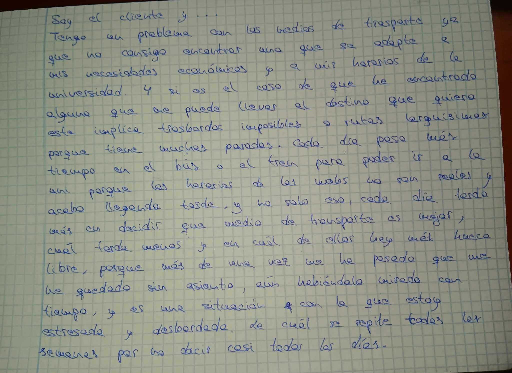

# Por-Fin-LLego

## Documentación Exclusiva del Problema a Resolver

Los estudiantes universitarios presentan descontento y frustración al no poder
llegar correctamente tanto a clase como a su hogar, problema que se acentúa en
aquellos estudiantes que no residen en la misma ciudad que en la que estudian.

La posibilidad de no tener como ir adecuadamente a cualquiera de los dos
destinos mencionados anteriormente, ya sea por, falta de plazas de última hora; 
incumplimiento de los horarios de los medios de trasporte, tanto de salida como
de llegada, impidiendo así futuros transbordos o dando lugar a llegar tarde; 
tienen como resultado la irritacion por parte de la juventud estudiantil con los
medios de transporte.

Principalmente por la indesición de que medio de trasporte es mejor, porque
incluso tras analizar, calcular y filtrar ellos mismos sus opciones, lo cuál
requiere un gran coste de su tiempo, estas pueden no ajustarse a la realidad. 

La cantidad de veces que realiza un estudiante, por semana, una búsquedad de
transportes que consuman menos tiempo de su día a día, tengan menos transbordos y 
se ajusten tanto a sus horarios como a su bolsillo es un dolor de cabeza y de
tiempo que cada vez les cuesta más sobrellevar.

## Fuentes de datos
Tipos de transportes del Consorcio de transportes que van de un destino a otro.
Tablas de paradas y rutas de un transporte dada una compañía.
Tablas de frecuencias y horarios de un transporte dada una compañía.
Tablas de precios de un transporte dada una compañía.

## Tarjeta Juego de rol

